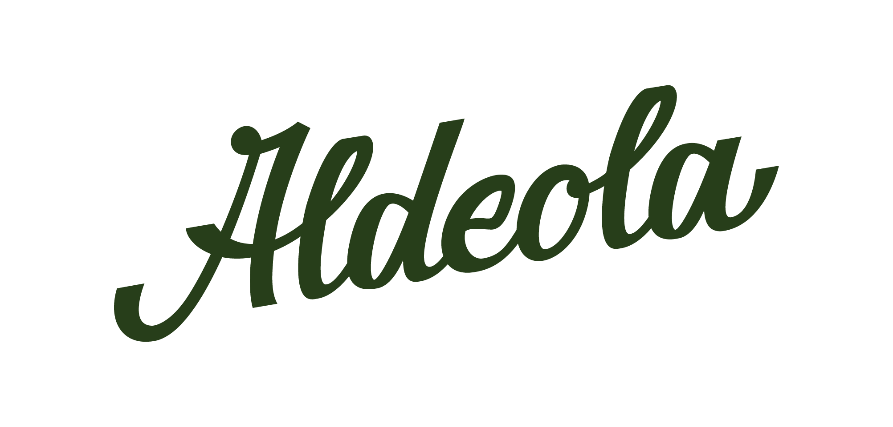

# 🍵 Aldeola Café & Bistrô

<div align="center">
  
  <br /><br />
  <p><em>Onde cada torta conta uma história</em></p>
</div>

## 📑 Sobre o Projeto

O Aldeola Café & Bistrô é um espaço gastronômico único que une a tradição do café de qualidade com um ambiente acolhedor e aconchegante. Este projeto representa o site oficial do Aldeola, desenvolvido para apresentar nossas unidades, cardápio e toda a experiência que oferecemos aos nossos clientes.

### ✨ Características

- 🏠 **Design Responsivo**: Experiência perfeita em qualquer dispositivo
- 🎨 **Identidade Visual**: Seguindo a paleta PANTONE exclusiva do Aldeola
- 🖼️ **Carrossel Dinâmico**: Apresentação visual das nossas instalações
- 📍 **Mapa Interativo**: Integração com Google Maps e Waze para nossas unidades

## 🚀 Tecnologias

Este projeto foi desenvolvido utilizando:

- [React](https://reactjs.org/)
- [Vite](https://vitejs.dev/)
- CSS Moderno (Flexbox e Grid)
- Font Awesome para ícones
- Google Fonts

## 🛠️ Instalação e Uso

Siga estes passos para executar o projeto localmente:

```bash
# Clone o repositório
git clone https://github.com/seu-usuario/aldeola.git

# Acesse a pasta do projeto
cd aldeola

# Instale as dependências
npm install

# Execute o projeto em modo de desenvolvimento
npm run dev
```

Acesse `http://localhost:5173` para visualizar a aplicação.

## 📱 Seções do Site

- **Home**: Apresentação e boas-vindas
- **Unidades**: Nossas localizações com opções de navegação
- **Ambiente**: Fotos e características do nosso espaço
- **Sobre**: Nossa história e valores
- **Contato**: Informações para reservas e contato

## 🎨 Paleta de Cores

O projeto utiliza a seguinte paleta de cores PANTONE:

- **PANTONE 2411 C** (Verde escuro): `#283F1C` - Cor primária
- **PANTONE 5773 C** (Verde oliva): `#888C60` - Cor secundária
- **Verde intermediário**: `#6A7147` - Cor terciária
- **Verde oliva claro**: `#A5A98B` - Cor terciária clara
- **Verde oliva vibrante**: `#A8AD78` - Cor de destaque

## 📝 Licença

Este projeto está sob a licença MIT. Veja o arquivo [LICENSE](LICENSE) para mais detalhes.

---

<div align="center">
  <p>Feito com ☕ e 💚 por Aldeola Café & Bistrô</p>
  <p>© 2024 Aldeola - Todos os direitos reservados</p>
</div>
